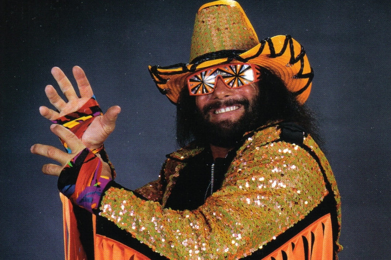

# Macho Moods

<aside>
<strong>In this project you will:</strong> Build a wireframe, write CSS with Flexbox, generate HTML with Javascript, and write modular code
</aside>

## "There are no tough guys in wrestling!"

People deal with a variety of emotions every day, including wrestling fans. Macho Man, Randy Savage, realizes this and has taken an interest in mental health. He believes he can encourage and uplift his fan base through a multitude of emotions and feelings with his famous quotes. He’s hired you - a team of macho developers - to build this self help site to encourage those going through big emotions. 

He has some very specific design requirements in mind, which surprised you because you didn’t expect a professional wrestler to know or care anything about UI/UX design. 

### This is what Mr. Savage is asking you to build: 

> At the top of the page should be the name of the motivational site, “Macho Moods”, centered on the page. Beneath the title should be a prompt, “How are you feeling today?”
>
>Underneath this, all nine moods and encouraging quotes should be displayed in a three-column format. Each mood should have the following format: 
>
>The name of the mood should be at the top and centered. The image for the mood should be beneath the name. Under the image should be a box containing the encouraging quotes for the mood. The box should have “Macho Advice:” on the left and the two quotes vertically aligned on the right.
>
>Mr. Savage is a fan of flare. He expects loud fonts, bright colors, shadows, rounded borders, and more. He wants you to have creative freedom, but if you present him with a boring, black and white, jumbled mess, he’ll probably smash it to pieces.
> 

Before you even think about coding, discuss and plan this project with your team. The first step of planning is to build a wireframe, this way you all have a clear goal in mind of what you’re building. Don’t worry about what colors or fonts you will use in the wireframe. Just create a general mockup of what Randy has described.
